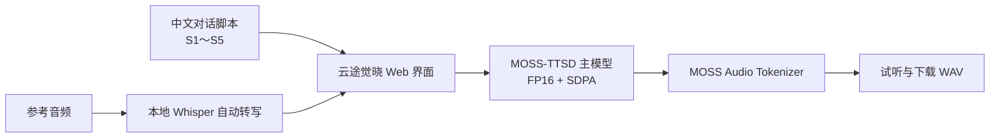

<div align="center">

# 云途觉晓多人云音创作平台

**面向中文创作者的本地化多人对话语音工作室**

把带角色标记的脚本转换为自然、连贯的多人语音；支持参考音色、自动转写与 Tesla V100 部署。

[](https://www.python.org/)
[](https://pytorch.org/)
[](https://developer.nvidia.com/cuda-toolkit)
[](./README_V100.md)
[](./LICENSE-MIT)
[](./LICENSE)

[功能亮点](#功能亮点) · [快速开始](#快速开始) · [使用方法](#使用方法) · [V100 部署](./README_V100.md) · [原作者与致谢](#原作者与致谢)

</div>

> [!IMPORTANT]
> 本项目是基于 [OpenMOSS/MOSS-TTSD](https://github.com/OpenMOSS/MOSS-TTSD) 的独立社区改造版本，并非 OpenMOSS 官方发行版。底层模型、原始推理代码及其著作权归原作者所有；本仓库完整保留原项目署名和 Apache 2.0 许可证。

## 项目简介

云途觉晓多人云音创作平台将 MOSS-TTSD 的多人对话生成能力封装成更适合中文用户的可视化工作流。用户可以直接编写单人朗读、双人访谈或最多五人的对话脚本，按需上传参考音频，随后在浏览器中生成、试听和下载作品。

本版本针对 Tesla V100 做了专门适配：避开 V100 不支持的 BF16 与 Flash Attention 2，使用经过验证的 FP16 + SDPA 路径，并可将主语言模型和音频编解码器拆分到两张显卡。参考音频原文由本地 Whisper 自动识别，音频不会发送到第三方服务。

## 功能亮点

| 能力 | 说明 |
| --- | --- |
| 全面简体中文 | 页面、参数说明、状态、校验错误及播放器辅助提示均提供简体中文 |
| 1～5 人对话 | 使用 `[S1]`～`[S5]` 控制角色，支持单人朗读、访谈、播客和剧情对话 |
| 参考音色续说 | 为不同角色分别上传短参考音频，保持角色音色的一致性 |
| 自动识别参考原文 | 集成 Whisper Large-v3 Turbo；上传后自动转写为简体中文，支持手动修正和重新识别 |
| V100 原生兼容 | 自动使用 FP16 + SDPA，避免 BF16 / Flash Attention 2 在 Compute Capability 7.0 上的不兼容问题 |
| 双 GPU 分工 | 推荐主模型运行在 GPU 1、音频编解码器运行在 GPU 0，降低单卡显存压力 |
| 本地与离线优先 | 权重准备完成后可离线运行；参考音频、转写和生成结果均留在服务器本地 |
| 安全的任务队列 | 自动转写与语音生成共用串行队列，降低多个大模型同时争抢显存的风险 |
| 可恢复模型下载 | 提供固定版本、分段续传及 SHA-256 校验工具，适合大文件下载不稳定的网络环境 |
| Windows 服务化 | 提供启动脚本、计划任务和局域网防火墙配置示例，便于长期部署 |

底层 MOSS-TTSD v1.0 提供 20 种语言与长上下文能力；实际可生成长度和速度取决于显卡、生成参数及输入内容。当前社区版本重点验证了中文、多人对话、参考音色和 V100 推理链路。

## 工作流程



## 运行要求

- Windows 10/11 或 Windows Server；核心代码也可在 Linux 上运行。
- Python 3.11。
- 支持 CUDA 12.4 的 NVIDIA 驱动。
- 推荐两张 Tesla V100 32 GB；单张 32 GB 显卡可尝试把两个设备都设为 `cuda:0`。
- 首次安装需要联网下载依赖和模型；模型权重不包含在本仓库中。

## 快速开始

以下示例使用推荐目录 `C:\AI\MOSS-TTSD`。在 PowerShell 中执行：

### 1. 获取代码并创建主环境

```powershell
New-Item -ItemType Directory -Force C:\AI | Out-Null
git clone https://github.com/sapplex-sz/YuntuJuexiao-MultiVoice-Studio.git C:\AI\MOSS-TTSD
Set-Location C:\AI\MOSS-TTSD

py -3.11 -m venv .venv
.\.venv\Scripts\python.exe -m pip install --upgrade pip
.\.venv\Scripts\python.exe -m pip install -r requirements-v100.txt
.\.venv\Scripts\python.exe -m pip check
```

### 2. 下载固定版本的生成模型

```powershell
.\.venv\Scripts\python.exe scripts\download_models.py --root C:\AI\models
```

如果大文件下载反复中断，可使用支持分段续传与校验的工具；详细参数见 [V100 部署说明](./README_V100.md)。

### 3. 安装本地自动转写

自动转写使用独立环境，不改动语音生成依赖：

```powershell
py -3.11 -m venv .venv-asr
.\.venv-asr\Scripts\python.exe -m pip install -r requirements-asr.lock.txt
.\.venv-asr\Scripts\python.exe scripts\download_asr_model.py `
  --output C:\AI\models\faster-whisper-large-v3-turbo
```

### 4. 启动平台

双 V100 推荐配置：

```powershell
.\.venv\Scripts\python.exe gradio_demo.py `
  --model_path C:\AI\models\MOSS-TTSD-v1.0 `
  --codec_path C:\AI\models\MOSS-Audio-Tokenizer `
  --device cuda:1 `
  --codec_device cuda:0 `
  --dtype float16 `
  --attn_implementation sdpa `
  --host 0.0.0.0 `
  --port 7863
```

也可以在推荐目录下直接运行 `scripts\start-windows.cmd`。启动完成后访问：

- 服务器本机：`http://127.0.0.1:7863/`
- 同一局域网：`http://<服务器 IP>:7863/`

> [!WARNING]
> 当前 Web 界面没有内置账号认证。使用 `--host 0.0.0.0` 时，请只向可信局域网开放端口，或在前方增加带身份认证的反向代理；不要直接暴露到公网。

## 使用方法

### 直接生成

1. 选择“单人朗读”“双人对话”或“播客开场”，也可以自己填写脚本。
2. 每段台词以前缀标明角色：

```text
[S1]欢迎来到云途觉晓多人云音创作平台。
[S2]今天我们用一段双人对话演示多人语音生成。
```

3. 说话人数要与脚本中出现的角色一致。
4. 点击“生成语音”，完成后在右侧试听或下载 WAV。

### 使用参考音色

1. 展开“参考音色”。
2. 为相应说话人上传建议 5～30 秒、背景干净的单人人声音频。
3. 等待系统自动识别原文；检查人名、数字和漏字，必要时手动修改。
4. 在“对话台词”中填写要生成的新内容，然后生成语音。

自动识别支持自动判断语言，也可以指定中文或英语后点击“重新识别原文”。每次识别由短生命周期子进程完成，结束或超时后释放显存。有效时长为 0.5～120 秒；静音、损坏或过长音频会显示明确提示。

## V100 适配说明

Tesla V100 的 Compute Capability 为 7.0，不支持 BF16，也不适合当前依赖中的 Flash Attention 2 路径。本项目增加了以下兼容处理：

- V100 默认使用 `torch.float16`。
- 注意力实现默认回退到 PyTorch SDPA。
- 音频编解码器保持 FP32，避免精度与算子兼容问题。
- 主模型与编解码器支持通过 `--device`、`--codec_device` 分配到不同 GPU。
- 提供 V100 冒烟测试、依赖锁定和 Windows 启动脚本。

完整配置、批处理、服务注册与验证方式见 [README_V100.md](./README_V100.md)。

## 测试

不加载模型的回归测试：

```powershell
.\.venv\Scripts\python.exe -m unittest discover -s tests -v
```

真实 V100 生成测试：

```powershell
.\.venv\Scripts\python.exe scripts\smoke_test_v100.py `
  --model_path C:\AI\models\MOSS-TTSD-v1.0 `
  --codec_path C:\AI\models\MOSS-Audio-Tokenizer `
  --device cuda:1 `
  --codec_device cuda:0
```

真实自动转写测试：

```powershell
.\.venv\Scripts\python.exe scripts\smoke_test_asr.py `
  --audio path\to\clear-chinese-reference.wav
```

## 项目结构

```text
├── gradio_demo.py              # 推理入口、输入校验和中文状态
├── studio_ui.py                # 简体中文创作界面
├── reference_asr.py            # 自动转写调度、超时与错误处理
├── runtime_compat.py           # V100 精度和注意力兼容策略
├── requirements-v100*.txt      # V100 生成环境依赖
├── requirements-asr*.txt       # 独立转写环境依赖
├── scripts/
│   ├── asr_worker.py           # 短生命周期 Whisper 转写进程
│   ├── download_models*.py     # 固定版本与可恢复模型下载
│   ├── start-windows.cmd       # 双 V100 启动入口
│   └── smoke_test_*.py         # 真实模型验证
└── tests/                      # 兼容性、下载、转写与界面回归测试
```

## 安全与负责任使用

本项目用于合法的内容创作、教育、研究、辅助技术和已获授权的声音应用。请勿在未获得声音权利人明确授权的情况下克隆、模仿或传播他人声音，也不得用于冒充、诈骗、虚假信息、深度伪造或其他违法用途。生成内容发布时，建议清晰披露其为 AI 合成音频。

## 原作者与致谢

本项目建立在 OpenMOSS 团队的研究和开源工作之上：

- 原始项目：[OpenMOSS/MOSS-TTSD](https://github.com/OpenMOSS/MOSS-TTSD)
- 原始版权：Copyright 2025 OpenMOSS Team, Fudan University, SII and MOSI
- 原始许可证：[Apache License 2.0](./LICENSE)
- 原始论文：[MOSS-TTSD: Text to Spoken Dialogue Generation](https://arxiv.org/abs/2603.19739)
- 原始作者：Yuqian Zhang、Donghua Yu、Zhengyuan Lin、Botian Jiang、Mingshu Chen、Yaozhou Jiang、Yiwei Zhao、Yiyang Zhang、Yucheng Yuan、Hanfu Chen、Kexin Huang、Jun Zhan、Cheng Chang、Zhaoye Fei、Shimin Li、Xiaogui Yang、Qinyuan Cheng、Xipeng Qiu

自动转写能力基于 [faster-whisper](https://github.com/SYSTRAN/faster-whisper) 和 [CTranslate2](https://github.com/OpenNMT/CTranslate2)。感谢所有原作者和开源贡献者。

### 论文引用

如果你的研究使用了底层 MOSS-TTSD 模型，请引用原论文：

```bibtex
@misc{zhang2026mossttsdtextspokendialogue,
  title        = {MOSS-TTSD: Text to Spoken Dialogue Generation},
  author       = {Yuqian Zhang and Donghua Yu and Zhengyuan Lin and Botian Jiang
                  and Mingshu Chen and Yaozhou Jiang and Yiwei Zhao and Yiyang Zhang
                  and Yucheng Yuan and Hanfu Chen and Kexin Huang and Jun Zhan
                  and Cheng Chang and Zhaoye Fei and Shimin Li and Xiaogui Yang
                  and Qinyuan Cheng and Xipeng Qiu},
  year         = {2026},
  eprint       = {2603.19739},
  archivePrefix= {arXiv},
  primaryClass = {cs.SD},
  url          = {https://arxiv.org/abs/2603.19739}
}
```

## 许可证

这是一个包含不同来源代码的衍生项目：

- 从 MOSS-TTSD 继承或修改的代码继续遵循 [Apache License 2.0](./LICENSE)，并保留原始版权和 [NOTICE](./NOTICE)。
- 云途觉晓独立新增的界面、V100 部署、自动转写集成及其他原创扩展以 [MIT License](./LICENSE-MIT) 开源。
- 模型权重不会随本仓库分发；下载和使用模型时还应遵守对应模型卡所列条款。

欢迎提交 Issue 与 Pull Request。参与贡献即表示你有权提交相关代码，并同意你的新增贡献按上述适用许可证发布。
